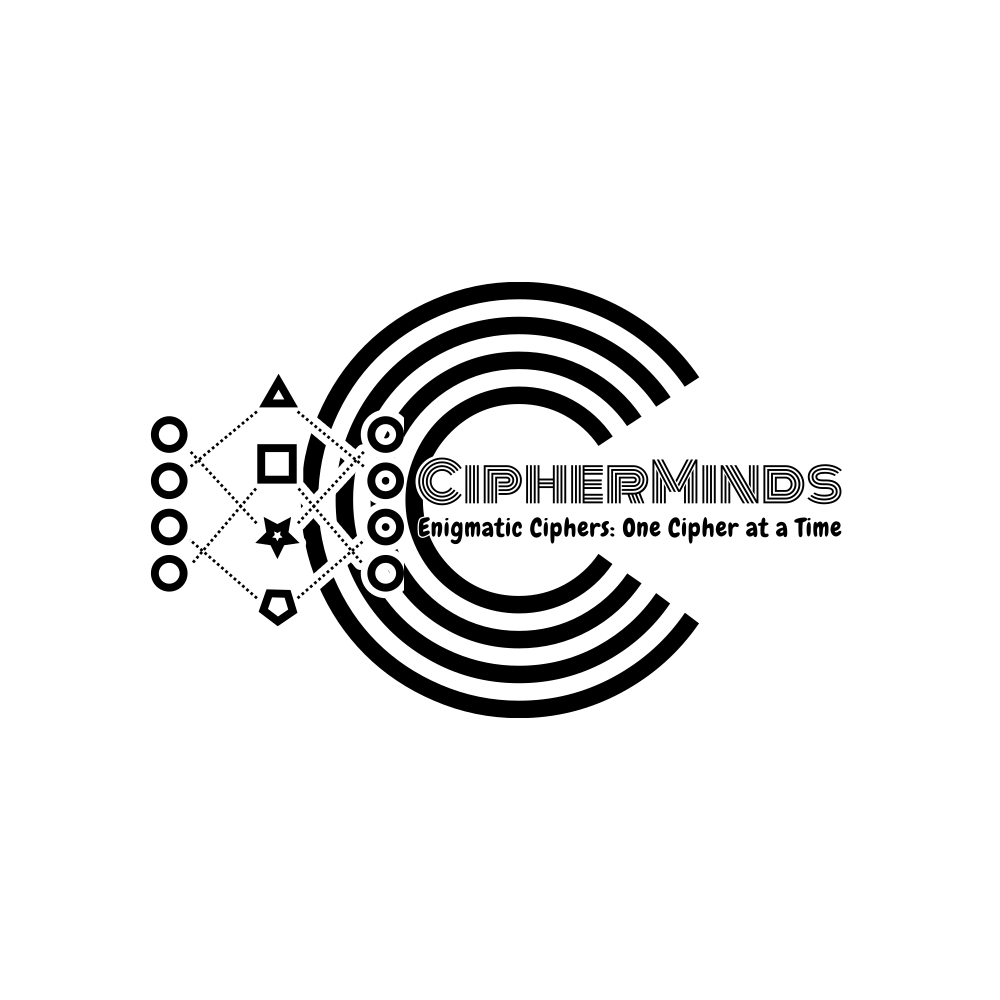

# CipherMinds

## Table of Contents
1. [Introduction](#introduction)
2. [Features](#features)
3. [Installation](#installation)
4. [Getting Started](#getting-started)
5. [Usage](#usage)
6. [Contributing](#contributing)
7. [License](#license)

## Introduction

Welcome to CipherMinds, an innovative platform for individuals to learn, grow, and excel across diverse fields of study. Our mission is to ignite the flames of curiosity, research, exploration, and decipherment across various disciplines. Whether it's computer engineering, mechanical engineering, electrical engineering, geography, history, medical sciences, or any other field in the world, CipherMinds is your gateway to decode the secrets of knowledge.

## Features

- **Multi-Disciplinary Learning:** Dive into a vast range of subjects, embracing every domain of knowledge, fostering a community of multidisciplinary learners.

- **Decipher Challenges:** Engage in interactive challenges, solving enigmatic puzzles, and uncovering the hidden wisdom within.

- **Community of Learners:** Collaborate with fellow learners, researchers, and explorers, creating an environment of shared growth and empowerment.

- **Resource Library:** Access a curated repository of articles, tutorials, and resources covering various fields of study, supporting your quest for knowledge.

- **Personal Growth Track:** Create a personalized profile, track your learning journey, set goals, and earn achievements as you conquer new frontiers of knowledge.

## Installation

CipherMinds is a web-based platform, and there's no installation required. Simply visit our website [www.cipherminds.com](https://www.cipherminds.com) to embark on your journey of limitless learning.

## Getting Started

To get started with CipherMinds, sign up for a free account on our website. This will grant you access to a world of knowledge and opportunities for growth. Start exploring various fields, participating in decipher challenges, and connecting with a vibrant community of like-minded learners.

## Usage

CipherMinds is designed to be user-friendly and intuitive. Navigate seamlessly through diverse fields of study, explore resources, and participate in decipher challenges to unleash your true potential for continuous learning.

## Contributing

We welcome contributions from passionate individuals who wish to expand the horizons of knowledge on CipherMinds. Whether you have unique challenges to share, informative resources, or ideas to enhance the platform, we invite you to contribute. Please review our [Contribution Guidelines](CONTRIBUTING.md) for more details.

## License

CipherMinds is released under the [MIT License](LICENSE). Feel free to use, modify, and distribute the platform as per the terms of the license.

---

Thank you for choosing CipherMinds as your companion on the journey of learning, researching, exploring, and deciphering the vast universe of knowledge. We hope that together, we will unlock the boundless potential of every individual to thrive in every field imaginable. For any questions or suggestions, feel free to contact us at contact@cipherminds.com.

Happy learning and decoding!
